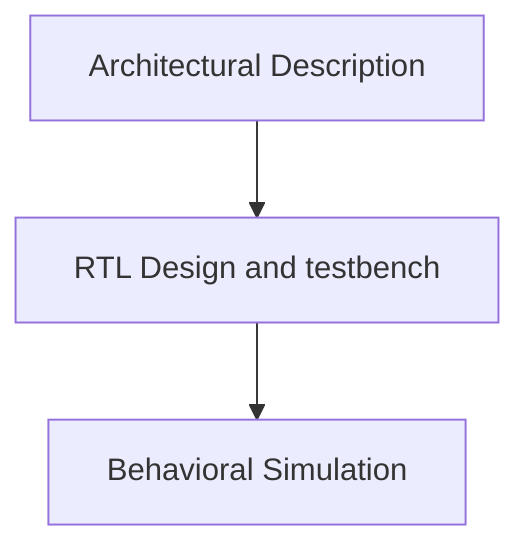

## Day 1

### FPGA Introduction

#### Flow

 We shall be looking at a 4-bit counter example and the RISC-V RVMyth Processor through two flows:
- Vivado
- Skywater OpenSource FPGGA (SOFA)

#### FPGA and FPGA Architecture

Programmable Logic Devices.
- The hardware can be customized after the manufacturing by programming the device
- PLA - Produces Minterms, Variable AND Gates, Input to OR Gates is fixed. But sequential elements cannot be programmed using this
- CPLD - Complex Programmable Logic Devices
- FPGA - Field Programmable Gate Arrays

FPGA consists of Lookup Tables, Flip Flops and CLBs (Configurable Logic Blocks)
#### ASIC Vs FPGAs

| ASIC                          | FPGA           |
| ---------------------         |:-------------: |
| Not programmable              | Reprogrammable |
| Final Stage implementation    | Useful in prototyping a design|  
| Huge time required to design  | Less Time Comparatively      |
| RTL to Layout                 | RTL to Bitstream generation |

#### Applications
- FPGAs are good for implementing algorithms which are able to run parallely.
- Hardware acceleration implementation of **Neural Networks**.
- Embedded Systems
- Machine Learning

#### FPGA Architecture

- Can be used to implement any combinatorial and sequential design.


(Diagram taken from Course Slide for reference)

An FPGA Architecture consists of

- **Configurable Logic Blocks** 
	* It contains an N-input Lookup Tables, Carry chain, Multiplexer and a Flip Flop. 

- **Programmable Interconnects**
	* The wires which connect the CLBs.
	
- **Programmable I/O**

#### Bitstream

- User generates a bitstream for their design specification, and uploads it into the board.
- Bitstream describes what CLBs that have to be connected and their function.
- It also defines the connection between the CLBs and I/Os.

#### Lookup table

- The Lookup table consists of all the possible minterms of a N-input function.
- Basically a function can be expressed as Sum of Products form or Sum of Minterms form.
- If we want to implement a logic function, the corresponding minterms of the function are selected by using the Mux.
- The output of the Mux feeds into the Flip Flop.
- A N - input Mux can be used to implement any N - input Function or some N + 1 input function with an additional NOT gate.


#### FPGA Programming

- HDL - Verilog
- HLS - C/C++/Python

#### FPGA Design Methodology




#### Synthesizable and Non - Synthesizable

**The following are non-synthesizable:**
- User defined delays
- Inital block
- nmos, pmos primitives
- Dynamic Memory allocation
- Infinite loops

#### Basys 3 FPGA Board


(Image taken from slide for reference)

#### Tools used

- Xilinx Vivado 2019.2 - https://www.xilinx.com/support/download/index.html/content/xilinx/en/downloadNav/vivado-design-tools/archive.html

#### Different ways of programming

- Local Programming using a board 
- Remote Programming - A FPGA connected to a remote server: I/O through Virtual I/O.

### Counter Example in Vivado

- We use a frequency synthesizer to generate a slow clock to observe the outputs

<details>
	<summary> Code </summary>
		
module counter(clk,reset,count);
input clk,reset;
output reg [3:0] count = 4'b0000;
reg [25:0] count_reg;
reg clk_div = 1'b0;

always @ (posedge clk)
begin
if (reset)
    begin
        clk_div <= 1'b0;
        count_reg <= 26'd0;
     end
else
    begin
        count_reg <= count_reg + 1;
        if (count_reg == 26'h3ffffff) // for synthesis
    //   if (count_reg == 26'd12) // for simulation
        begin
            clk_div <= ~ clk_div;
            count_reg <= 26'd0;
        end
    end
 end
  
	 always @ (posedge clk_div) begin
		 if (reset)
		 begin
		    count <= 4'b0000;
		 end
		 else
		 begin
		    count <= count + 1'b1;
		 end
	 end
endmodule			    
	
</details>
			    
			    
### Vivado-counter example

i. Type ```vivado``` in the terminal.
	
ii. Create a new project.

iii. Do the following settings

	
iv. Click finish.

v. Add source files
	- Set the testbench as top module while during Behavioural Simulation
	
vi. Run Behavioural Simulation
	

	- The output counter gets incremented at every posedge of the slow clock
	- This is the schematic


vii. Now set the design as top unit (not the testbench)

vii. Run Elaboration
	


	
viii. Do the I/O pin assignment as follows and save as ```constraints.xdc``` file.
	


#### Static Timing Analysis
	
##### Setup Time (Max. Delay) Constraints


- The data should be available **Tsetup**  before the **capturing clock edge** comes.
- We need **fast cells** to satisfy **Max Delay** constraints.
- Setup time constraints are always calculated with respect to the next clock edge.

##### Hold Time (Min. Delay) Constraints


- Data should be stable for **T-hold** after the clock edge to be captured properly.
- If the next data comes **earlier than T-hold**, the current data will not be captured properly.
- We need **slow cells** to satisfy **hold time** constraints

##### Setup Slack

- Setup slack = Required Arrival Time(Clock setup time) - Arrival Time (Data)
- Delay in clock helps us
- Delay in data is not feasible here

##### Hold Slack

- Hold Slack = Arrival Time(Data) - Required Arrival Time(hold time of FF)
- Here delay in data is helpful
- But delay in clock is not desirable.
	
#### Synthesis
- Now run synthesis.
	


- Since timing constraints are not specified, it will not report the timing information.
### Virtual Input/Output Counter


## Acknowledgements

- Dr. Xifan Tang, OpenFPGA and Chief Engineer RapidSilicon


