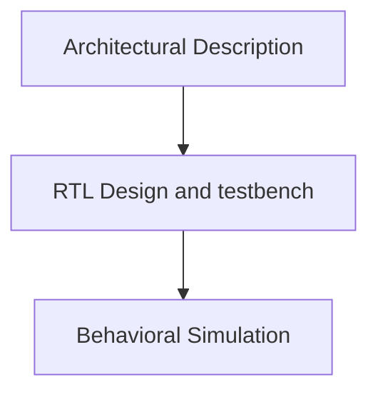

# Table of Contents

- [Table of Contents](#table-of-contents)
  - [Day 1](#day-1)
    - [FPGA Introduction](#fpga-introduction)
      - [Flow](#flow)
      - [FPGA and FPGA Architecture](#fpga-and-fpga-architecture)
      - [ASIC Vs FPGAs](#asic-vs-fpgas)
      - [Applications](#applications)
      - [FPGA Architecture](#fpga-architecture)
      - [Bitstream](#bitstream)
      - [Lookup table](#lookup-table)
      - [FPGA Programming](#fpga-programming)
      - [FPGA Design Methodology](#fpga-design-methodology)
      - [Synthesizable and Non - Synthesizable](#synthesizable-and-non---synthesizable)
      - [Basys 3 FPGA Board](#basys-3-fpga-board)
      - [Tools used](#tools-used)
      - [Different ways of programming](#different-ways-of-programming)
    - [Counter Example in Vivado](#counter-example-in-vivado)
    - [Vivado-counter example](#vivado-counter-example)
      - [Static Timing Analysis](#static-timing-analysis)
        - [Setup Time (Max. Delay) Constraints](#setup-time-max-delay-constraints)
        - [Hold Time (Min. Delay) Constraints](#hold-time-min-delay-constraints)
        - [Setup Slack](#setup-slack)
        - [Hold Slack](#hold-slack)
      - [Synthesis](#synthesis)
      - [Implementation](#implementation)
        - [Resource Utilization](#resource-utilization)
      - [Bit Stream](#bit-stream)
      - [Programming](#programming)
      - [Timing Analysis](#timing-analysis)
      - [Power](#power)
      - [Area](#area)
      - [Vivado Summary](#vivado-summary)
    - [Virtual Input/Output Counter](#virtual-inputoutput-counter)
    - [VIO Code](#vio-code)
    - [Elaboration and Pin Assignment](#elaboration-and-pin-assignment)
    - [Bitstream Generation](#bitstream-generation)
  - [Day 2](#day-2)
    - [Intro to OpenFPGA](#intro-to-openfpga)
    - [Custom FPGAs](#custom-fpgas)
    - [Verilog to Routing (VTR)](#verilog-to-routing-vtr)
    - [VTR FLow](#vtr-flow)
    - [VPR Flow on a Pre-Synthesized Design](#vpr-flow-on-a-pre-synthesized-design)
      - [.blif file](#blif-file)
      - [Lab on VPR on a Pre-Synthesized Design](#lab-on-vpr-on-a-pre-synthesized-design)
      - [Output of the VPR Step](#output-of-the-vpr-step)
      - [Timing Reports](#timing-reports)
        - [VPR Setup Slack](#vpr-setup-slack)
        - [VPR Hold Slack](#vpr-hold-slack)
      - [Constraints](#constraints)
    - [VTR Flow](#vtr-flow-1)
      - [VTR Synthesis and Simulation](#vtr-synthesis-and-simulation)
      - [VTR Timing Analysis](#vtr-timing-analysis)
      - [Area Analysis](#area-analysis)
      - [Power Analysis](#power-analysis)
    - [Comparison of Basys3 and VTR Flow](#comparison-of-basys3-and-vtr-flow)
      - [Post Implementation Timing](#post-implementation-timing)
      - [Area Comparison](#area-comparison)
      - [Power Comparison](#power-comparison)
  - [Day 3 RISC - V core Programming on Vivado](#day-3-risc---v-core-programming-on-vivado)
    - [RTL-to-Synthesis](#rtl-to-synthesis)
      - [Behavioural Simulation](#behavioural-simulation)
      - [Elaboration](#elaboration)
    - [Synthesis-to-bitstream](#synthesis-to-bitstream)
      - [Core Resource Utilization](#core-resource-utilization)
      - [Schematic](#schematic)
      - [Implementation](#implementation-1)
      - [Bitstream-Generation for RISC - V core](#bitstream-generation-for-risc---v-core)
  - [Day 4 - SOFA FPGA Fabric IP](#day-4---sofa-fpga-fabric-ip)
    - [Intro to SOFA](#intro-to-sofa)
      - [SOFA counter Statistics](#sofa-counter-statistics)
    - [SOFA counter Timing Analysis](#sofa-counter-timing-analysis)
      - [SOFA counter Timing Report](#sofa-counter-timing-report)
    - [SOFA counter Post Implementation](#sofa-counter-post-implementation)
    - [SOFA Power Analysis](#sofa-power-analysis)
  - [Day 5](#day-5)
  - [Acknowledgements](#acknowledgements)

## Day 1

### FPGA Introduction

#### Flow

We shall be looking at a 4-bit counter example and the RISC-V RVMyth Processor through two flows:

- Vivado
- Skywater OpenSource FPGGA (SOFA)

#### FPGA and FPGA Architecture

Programmable Logic Devices.

- The hardware can be customized after the manufacturing by programming the device
- PLA - Produces Minterms, Variable AND Gates, Input to OR Gates is fixed. But sequential elements cannot be programmed using this
- CPLD - Complex Programmable Logic Devices
- FPGA - Field Programmable Gate Arrays

FPGA consists of Lookup Tables, Flip Flops and CLBs (Configurable Logic Blocks)

#### ASIC Vs FPGAs

| ASIC                         |              FPGA              |
| ---------------------------- | :----------------------------: |
| Not programmable             |         Reprogrammable         |
| Final Stage implementation   | Useful in prototyping a design |
| Huge time required to design |    Less Time Comparatively     |
| RTL to Layout                |  RTL to Bitstream generation   |

#### Applications

- FPGAs are good for implementing algorithms which are able to run parallely.
- Hardware acceleration implementation of **Neural Networks**.
- Embedded Systems
- Machine Learning

#### FPGA Architecture

- Can be used to implement any combinatorial and sequential design.


(Diagram taken from Course Slide for reference)

An FPGA Architecture consists of

- **Configurable Logic Blocks**

  - It contains an N-input Lookup Tables, Carry chain, Multiplexer and a Flip Flop.

- **Programmable Interconnects**

  - The wires which connect the CLBs.

- **Programmable I/O**

#### Bitstream

- User generates a bitstream for their design specification, and uploads it into the board.
- Bitstream describes what CLBs that have to be connected and their function.
- It also defines the connection between the CLBs and I/Os.

#### Lookup table

- The Lookup table consists of all the possible minterms of a N-input function.
- Basically a function can be expressed as Sum of Products form or Sum of Minterms form.
- If we want to implement a logic function, the corresponding minterms of the function are selected by using the Mux.
- The output of the Mux feeds into the Flip Flop.
- A N - input Mux can be used to implement any N - input Function or some N + 1 input function with an additional NOT gate.


#### FPGA Programming

- HDL - Verilog
- HLS - C/C++/Python

#### FPGA Design Methodology




#### Synthesizable and Non - Synthesizable

**The following are non-synthesizable:**

- User defined delays
- Inital block
- nmos, pmos primitives
- Dynamic Memory allocation
- Infinite loops

#### Basys 3 FPGA Board


(Image taken from slide for reference)

#### Tools used

- Xilinx Vivado 2019.2 - <https://www.xilinx.com/support/download/index.html/content/xilinx/en/downloadNav/vivado-design-tools/archive.html>

#### Different ways of programming

- Local Programming using a board
- Remote Programming - A FPGA connected to a remote server: I/O through Virtual I/O.

### Counter Example in Vivado

- We use a frequency synthesizer to generate a slow clock to observe the outputs

<details>
 <summary> Code </summary>

```verilog
module counter(clk,reset,count);
input clk,reset;
output reg [3:0] count = 4'b0000;
reg [25:0] count_reg;
reg clk_div = 1'b0;

always @ (posedge clk)
begin
if (reset)
    begin
        clk_div <= 1'b0;
        count_reg <= 26'd0;
        ///count <= 4'b0;
     end
else
    begin
        count_reg <= count_reg + 1;
    /// if (count_reg == 26'h3ffffff) // for synthesis
        if (count_reg == 26'd12) // for simulation
        begin
            clk_div <= ~ clk_div;
            count_reg <= 26'd0;
        end
    end
 end

  always @ (posedge clk_div) begin
   if (reset)
   begin
      count <= 4'b0000;
   end
   else
   begin
      count <= count + 1'b1;
   end
  end
endmodule
```

</details>

### Vivado-counter example

i. Type `vivado` in the terminal.

ii. Create a new project.

iii. Do the following settings


iv. Click finish.

v. Add source files

- Set the testbench as top module while during Behavioural Simulation

vi. Run Behavioural Simulation


- The output counter gets incremented at every posedge of the slow clock

vii. Now set the design as top unit (not the testbench)

vii. Run Elaboration


viii. Do the I/O pin assignment as follows and save as `constraints.xdc` file.


#### Static Timing Analysis

##### Setup Time (Max. Delay) Constraints


- The data should be available **Tsetup** before the **capturing clock edge** comes.
- We need **fast cells** to satisfy **Max Delay** constraints.
- Setup time constraints are always calculated with respect to the next clock edge.

##### Hold Time (Min. Delay) Constraints


- Data should be stable for **T-hold** after the clock edge to be captured properly.
- If the next data comes **earlier than T-hold**, the current data will not be captured properly.
- We need **slow cells** to satisfy **hold time** constraints

##### Setup Slack

- Setup slack = Required Arrival Time(Clock setup time) - Arrival Time (Data)
- Delay in clock helps us
- Delay in data is not feasible here

##### Hold Slack

- Hold Slack = Arrival Time(Data) - Required Arrival Time(hold time of FF)
- Here delay in data is helpful
- But delay in clock is not desirable.

#### Synthesis

i. Now run synthesis.


ii. Primary clock is selected.


iii. No generated clock.


iv Skip to finish.


v. Synthesized netlist


#### Implementation


##### Resource Utilization


#### Bit Stream


#### Programming

- Click program device to send the bitstream to the FPGA board.

#### Timing Analysis

This can be done after synthesis or after implementation.

i. Click on Report Timing Summary


ii. We can also view the detailed path report for each path. It specifies the starting and endpoint.


- As the slack is positive, all the timing constraints are met.

#### Power


#### Area

- Click on report Resource Utilization


- Summary


#### Vivado Summary

(insert tables of all the data)

### Virtual Input/Output Counter

- Using this method we can program a remote FPGA connected to a cloud.
- The VIO provides the inputs to the FPGA and probes the output.
- VIO output is the input to the FPGA
- VIO input is the output of the FPGA


### VIO Code

- Make these changes. The reset and clock are come from VIO. So they are no longer input ports. The counter output will be probed by the VIO, so it is no longer an output port.

**VIO Inputs:** Slow Clock, Counter Output
**VIO Outputs:**Reset


i. Click on IP Catalog in the Project Manager.

ii. Search VIO


iii. Configure as shown.


iv. Click generate

v. Go to IP Sources and click on Instantion Template and copy these lines from the `.veo` file.


vi. Use this to instantiate the VIO in the `.v` file


### Elaboration and Pin Assignment


### Bitstream Generation


## Day 2

### Intro to OpenFPGA

- It is an open source framework to quickly generated a custom FPGA fabric specific to our design
- It is automated
- Reduces development time
- Generally it takes 24 hours to produce a production ready layouts

### Custom FPGAs


- For certain applications custom-made FPGAs provide huge performance gain.
- Custom FPGA architectures are expensive to produce
- OpenFPGA allows us to customize our own FPGA fabrix using a set of templates
- Generate verilog netlists based on an XML file - VPR ( Versatile Place and Route )
- Automatically generates Verilog testbenches

Visit this repo to install OpenFPGA: <https://github.com/lnis-uofu/OpenFPGA>

### Verilog to Routing (VTR)

- XML - based architecture description language to describe the custom FPGA architecture
- **Download Link:** <https://github.com/verilog-to-routing/vtr-verilog-to-routing>
- **Documentation:** <https://docs.verilogtorouting.org>

- Basically it maps our RTL to a placed and routed FPGA


### VTR FLow


i. We shall first run VPR on a Pre-synthesized circuit.
ii. Then, we shall run entire VPR Flow from RTL

### VPR Flow on a Pre-Synthesized Design

i. **Packing** - combines the technology mapped netlist into (CLBs) Complex Logic Blocks.
ii. **Placement** - postition of the CLBs - it produces a .place file.
iii. **Routing** - interconnection between blocks
iv. **Analysis** - Analyzes the implementation

Input: Blif file, Earch

This is the general structure of a Earch.xml file. It describes the FPGA Architecture.

```xml
<!--
-->
<architecture>
  <models>
    <model name = "">
    </model>
  </models>
  <tiles>
    <tile name = "">
    </tile>
  </tiles>
  <layout> <!-- Grid Layout, aspect ratio -->
  </layout>
  <device> <!-- Transistor definitions -->
  </device>

  <switchlist>
  </switchlist>

  <segmentlist>
  </segmentlist>

  <directlist>
  </directlist>

</architecture>
```

#### .blif file

```blif
.names - LUTS
```

#### Lab on VPR on a Pre-Synthesized Design

i. Create a working directory.

```console
mkdir -p vtr_work/quickstart/vpr_tseng
cd ./vtr_work/quickstart/vpr_tseng
```

ii. Now pass the FPGA architecture and the technology mapped netlist of the design.

```console
$VTR_ROOT/vpr/vpr \
$VTR_ROOT/vtr_flow/arch/timing/EArch.xml \
$VTR_ROOT/vtr_flow/benchmarks/blif/tseng.blif \
--route_chan_width 100
--disp on
```


iii. Additional parameter can be applied here

```console
$VTR_ROOT/vpr/vpr \
$VTR_ROOT/vtr_flow/arch/timing/EArch.xml \
$VTR_ROOT/vtr_flow/benchmarks/blif/tseng.blif \
--route_chan_width 100
--analysis
--disp on
```

#### Output of the VPR Step


- .net file: post packed circuit, circuit in terms of CLBs.
- .place file: how the cells are placed
- .route file: interconnects
- .log file:

#### Timing Reports

##### VPR Setup Slack


- Here, the setup slack is violated as no clock constraints are specified.

##### VPR Hold Slack


#### Constraints

i. Create a `tseng.sdc` file

```sdc
create_clock -period 10 -name pclk
set_input_delay -clock pclk -max 0 [get_ports {*}]
set_output_delay -clock pclk -max 0 [get_ports {*}]
```

ii. Run include sdc file as part of the command

```console
$VTR_ROOT/vtr_flow/arch/timing/EArch.xml $VTR_ROOT/vtr_flow/benchmarks/blif/tseng.blif --route_chan_width 100 --disp on --sdc_file tseng.sdc
```

- Now we can see that the setup slack is met.


### VTR Flow

#### VTR Synthesis and Simulation

i. Run the automated VTR Flow command.

```console
$VTR_ROOT/vtr_flow/scripts/run_vtr_flow.py \
      /home/knavin2002/Desktop/openfpga/Day\ 2/vtr_work/counter.v \
      $VTR_ROOT/vtr_flow/arch/timing/EArch.xml \
      -temp_dir . --route_chan_width 100

```


ii. We can run vpr (flow analysis) on the pre-vpr file.blif file.

```console
$VTR_ROOT/vpr/vpr $VTR_ROOT/vtr_flow/arch/timing/EArch.xml \
                  counter --circuit_file counter.pre-vpr.blif \
                  --route_chan_width 100 \
                  --analysis --disp on
```


iii. Now run the entire VPR Flow

```console
$VTR_ROOT/vpr/vpr $VTR_ROOT/vtr_flow/arch/timing/EArch.xml \
                  counter --circuit_file counter.pre-vpr.blif \
                  --route_chan_width 100 --disp on

```


iv. Generation of Post implementation netlist

```console
$VTR_ROOT/vpr/vpr $VTR_ROOT/vtr_flow/arch/timing/EArch.xml \
                  counter.pre-vpr.blif \
                  --gen_post_synthesis_netlist on

```


- To run the post implementation netlist, we need primitves file

v. Simulation in Xilinx Vivaldo. Include post_synthesis file, testbench and primitives file


- Include the path to the .sdf file correctly in the testbench.


#### VTR Timing Analysis

- We have to pass the `.blif` to the VPR Flow otherwise the tool will have its own constraints.

i. Create a `constraints.sdc` file. Create constraints as follows. Also change the name of the clock in the pre-vpr.blif as `up_counter_clk`.

```sdc
create_clock -period 10 up_counter_clk
set_input_delay -clock up_counter_clk -max 0 [get_ports {*}]
set_output_delay -clock up_counter_clk -max 0 [get_ports {*}]
```

ii. Now run VPR flow with te timing constraints.

```console
  $VTR_ROOT/vpr/vpr \
  $VTR_ROOT/vtr_flow/arch/timing/EArch.xml \
  counter.pre-vpr.blif --route_chan_width 100 \
  --sdc_file /home/knavin2002/Desktop/openfpga/Day\ 2/tseng.sdc
```


iii. We can check whether the setup and hold time constraints are met.


iv. Now change the clock period to 5ns in `.sdc` file.


v. Check the setup and hold constraints.


- They are still met.

#### Area Analysis

i. Open `vpr_stdout.log` file.


#### Power Analysis

i. Include the `-power` and the `cmos_tech` xml file the vtr flow command.

```console
  $VTR_ROOT/vtr_flow/scripts/run_vtr_flow.py \
  /home/knavin2002/Desktop/openfpga/Day\ 2/vtr_work/counter.v \
  $VTR_ROOT/vtr_flow/arch/timing/EArch.xml -power -cmos_tech \
  $VTR_ROOT/vtr_flow/tech/PTM_45nm/45nm.xml \
  -temp_dir . --route_chan_width 100
```


### Comparison of Basys3 and VTR Flow

- Now we shall consolidating all the results from the Vivado flow and the VTR Flow of the counter design.

#### Post Implementation Timing


- `.sdc` file
- Clock period `10ns` or `100 MHz`

| Parameter                        | Basys3 | VTR Earch |
| :------------------------------- | :----: | :-------: |
| **Technology**                   |        |           |
| **Worst Negative Slack - Setup** |        |           |
| **Worst Negative Slack - Hold**  |        |           |

- Min. Slack

| Parameter                        | Basys3 | VTR Earch (ns) |
| :------------------------------- | :----: | :------------: |
| **Minimum Time Period**          |        |     $1.8$      |
| **Worst Negative Slack - Setup** |        |     $0.34$     |
| **Worst Negative Slack - Hold**  |        |    $0.293$     |

#### Area Comparison


#### Power Comparison


## Day 3 RISC - V core Programming on Vivado

- Now we shall go through the Vivado flow for the RVMyth Processor
- RISC - V RVMyth: <https://github.com/NAvi349/riscv-myth-ws>
- Converting TL - Verilog to Verilog: <https://github.com/NAvi349/mixed-riscv-soc>
- We shall test a program that sums numbers from 1 to N.
- N is 9 for this example.
- $Sumof(1 to 9) = 45$

### RTL-to-Synthesis

#### Behavioural Simulation

i. Create a new project and add the core as a source and add a testbench as simulation source.

ii. Run Behavioural Simulation.


- We can see the output is 45 as expected.

#### Elaboration

i. Assign pin number as shown.


ii. We shall use ILA to observer the outputs. So remove the output ports and declare it as reg.


iii. Run Elaboration again


iv. From IP Catalog instantiate ILA and connect to the RISC - V core


v. Run Synthesis and then add constraints


vi. Run synthesis


### Synthesis-to-bitstream

#### Core Resource Utilization


#### Schematic


#### Implementation

i. Run implementation.


ii. Report timing summary


- All the user constraints are met.

#### Bitstream-Generation for RISC - V core

i. Run Bitstream generation.


## Day 4 - SOFA FPGA Fabric IP

### Intro to SOFA

- **SOFA** - **S**kywate **O**pensource **F**PG**A**s
- Open-source FPGA IPs
- Skywater 130nm PDK and OpenFPGA Framework
- HD - High Density FPGAs - embedded FPGAs.
- **Documentation and installation:** <https://github.com/lnis-uofu/SOFA>

i. Clone the repository

```console
git clone https://github.com/lnis-uofu/SOFA.git
```

ii. Make `FPGA1212_QLSOFA_HD_PNR/` as the current directory.

iii. Copy the `counter.v` file to the benchmark folder.


iii. Open `task_simulation.conf`

```console
  gedit FPGA1212_QLSOFA_HD_task/config/task_simulation.conf
```


iv. Add the following lines under respective sections

```text
[BENCHMARKS]
bench0=${PATH:TASK_DIR}/BENCHMARK/counter_new/counter.v

[SYNTHESIS_PARAM]
bench0_top = up_counter
```


- `generate_testbench.openfpga` will call the vpr flow


- architecture is available under `arch` directory.


v. Run the makefile

```console
make runOpenFPGA
```


vi. View the generated files

```console
 cd FPGA1212_QLSOFA_HD_task/latest/vpr_arch/up_counter/MIN_ROUTE_CHAN_WIDTH/
```


#### SOFA counter Statistics


### SOFA counter Timing Analysis

i. Create `counter.sdc` file in the `counter_new` folder in `BENCHMARK`.

```sdc
create_clock -period 20 clk
set_input_delay -clock clk -max 0 [get_ports {*}]
set_output_delay -clock clk -max 0 [get_ports {*}]
```


ii. Open `generate_testbench.openfpga` and the `counter.sdc` file in the vpr arguments.


iii. Run the makefile command

```console
make runOpenFPGA
```


#### SOFA counter Timing Report

- Setup slack


- Hold Slack


### SOFA counter Post Implementation

i. Add this argument in the vpr flow in the `generate_testbench.openfpga` file.

```console
--gen_post_synthesis_netlist on
```


ii. Run makefile again


- post implementation file


iii. Run simulation through vivado.


### SOFA Power Analysis

i. Change this two lines in the `task_simulation.conf` file.


ii. Add this new line the `generate_testbench.openfpga` file

```console
vpr ${VPR_ARCH_FILE} ${VPR_TESTBENCH_BLIF} --clock_modeling ideal \
  --device ${OPENFPGA_VPR_DEVICE_LAYOUT} --route_chan_width ${OPENFPGA_VPR_ROUTE_CHAN_WIDTH} \
  --absorb_buffer_luts off --power \
  --activity_file /home/knavin2002/Desktop/openfpga/Day-4/SOFA/FPGA1212_QLSOFA_HD_PNR/FPGA1212_QLSOFA_HD_task/latest/vpr_arch/up_counter/MIN_ROUTE_CHAN_WIDTH/up_counter_ace_out.act \
  --tech_properties /home/kunalg123/Desktop/vtr-verilog-to-routing/vtr_flow/tech/PTM_45nm/45nm.xml
```


iii. Add the options for power analysis in `vpr_arch.xml` file.

```xml
<!-- added for power analysis  -->
  <power>
      <local_interconnect C_wire="2.5e-10"/>
      <mux_transistor_size mux_transistor_size="3"/>
      <FF_size FF_size="4"/>
      <LUT_transistor_size LUT_transistor_size="4"/>
  </power>
  <clocks>
    <clock buffer_size="auto" C_wire="2.5e-10"/>
  </clocks>
```


iv. Run the makefile command again.


v. See the output in `counter.power`.


## Day 5 SOFA RISC - V Core

- We shall fall the same steps for the RISC - V RVMyth Core


i. Git clone the SOFA repo as before.

ii. Make these changes in the corresponding files. Also refer to the files in the Day 5 folder. Comment lines 157 and 158, line 259 in the `vpr.xml`.


iii. Run makefile command


iv. Open `openfpgashell.log`.


### RISC - V Resource Utilization

- Open `vpr_stdout.log` for the output statistics.


- Logic Elements


### SOFA RISC - V Timing Reports

i. Create `.sdc` file

```sdc
create_clock -period 200 clk
set_input_delay -clock clk -max 0 [get_ports {*}]
set_output_delay -clock clk -max 0 [get_ports {*}]
```

ii. Pass the .sdc file as argument in `generate_testbench.openfpga`


iii. Run the makefile command.

- Setup slack


- Hold slack


###

## Acknowledgements

- Dr. Xifan Tang, OpenFPGA and Chief Engineer RapidSilicon
